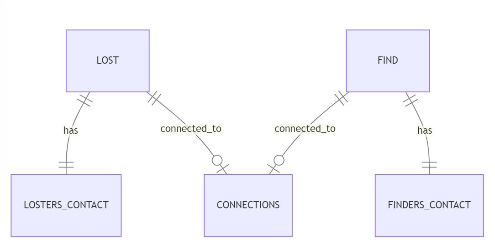

# Design Document

By YOUR NAME HERE - Gabriel Paweł Henoch Dobrowolski

Video overview: <URL https://www.youtube.com/watch?v=FVFC29jEqhM>

## Scope

In this section you should answer the following questions:

* What is the purpose of your database? - The purpose of my database is to collect informations about lost things and people who have lost their things in Poznań area (city in Poland)

* Which people, places, things, etc. are you including in the scope of your database? - Including in the scope of my database: PEOPLE who lost something, or find some losted things, LOCATIONS where some of the lost items were found, Founded and losted THINGS

* Which people, places, things, etc. are *outside* the scope of your database? - Outside the scope of my database: PEOPLE who does not lost something, or find some losted things, LOCATIONS where nothing has ever been lost, THINGS that are not lost

## Functional Requirements

In this section you should answer the following questions:

* What should a user be able to do with your database? - A user should be able to do the following things with the database:
A) Report Lost Items: Users can enter details about items they have lost, like a description, where it was lost, the date, the condition of the item, and any extra information
B) Report Found Items: Users can also report items they have found, giving similar details such as a description, location, date, condition, and extra information
C) Search for Lost Items: Users can search the database for lost items using different criteria like location, date, or description
D) Search for Found Items: Users can search for found items using the same criteria
E) Update Item Status: Users should be able to update the status of their reported items (for example marking a lost item as found)
F) Link Lost and Found Items: Admins can link lost items with found items, making sure the right owners can get their belongings back

* What's beyond the scope of what a user should be able to do with your database? - The following things are beyond the scope of what a user should be able to do with the database:
A) Edit Other Users' Entries: Users should not be able to edit or delete entries made by other users. Each user can only manage their own entries
B) Automated Matching: The database does not support automatic matching of lost and found items. Linking items is done manually by admins to ensure accurate matches
C) Access Personal Contact Information: Users should not be able to see personal contact information of other users beyond what is needed for reporting and retrieving lost items

## Representation

The entities and their attributes are defined in the schema.sql file

### Entities

In this section you should answer the following questions:

* Which entities will you choose to represent in your database?
* What attributes will those entities have?
* Why did you choose the types you did?
* Why did you choose the constraints you did? - Database have following entities:

Lost TABLE includes:
'id' the unique id number of each lost thing
'loster_id' the id of person who lost something
'loster_name' person`s first name who lost something
'thing' what thing was lost
'location' in which district of Poznań thing was lost
'date' date when thing was lost
'conditions' in which condition this thing was lost (deafult NULL)
'additional_informations' possible additional information (if any)
'still_current' whether the item is still considered lost (0 if yes, 1 if no)

Find TABLE includes:
'id' the unique id number of each found thing
'finder_id' the id of person who found something
'finder_name' person’s first name who found something
'thing' what thing was found
'location' in which district of Poznań thing was found
'date' date when thing was found
'condition' in which condition this thing was found (default NULL)
'additional_informations' possible additional information (if any)
'still_current' whether the item is still available for claiming (0 if yes, 1 if no)

Connections TABLE includes:
'lost_id' the id of the lost item (foreign key to 'Lost' table)
'find_id' the id of the found item (foreign key to 'Find' table)

Losters_Contact TABLE includes:
'lost_id' the id of the lost item (foreign key to 'Lost' table)
'phone' the phone number of the person who lost the item
'email' the email address of the person who lost the item

Finders_Contact TABLE includes:
'find_id' the id of the found item (foreign key to 'Find' table)
'phone' the phone number of the person who found the item
'email' the email address of the person who found the item

### Relationships

erDiagram
    LOST ||--|| LOSTERS_CONTACT : "has"
    LOST ||--o| CONNECTIONS : "connected_to"
    FIND ||--o| CONNECTIONS : "connected_to"
    FIND ||--|| FINDERS_CONTACT : "has"

lost_id from Connections TABLE is foreign key to id from Lose TABLE
find_id from Connections TABLE is foreign key to id from Find TABLE
lost_id from Losters_Contact TABLE is foreign key to id from Lose TABLE
find_id from Finders_Contact TABLE is foreign key to id from Find TABLE

## Optimizations

In this section you should answer the following questions:

* Which optimizations (e.g., indexes, views) did you create? Why? - VIEWS I CREATED:
A) "location_lost" VIEW which shows thing and location from "lost" table (if someone want to know only these two informations)
B) "location_find" VIEW which shows thing and location from "find" table (if someone want to know only these two informations)
C) "matched_items" VIEW and thats ala extended "connections" TABLE (if someone want to know more than id`s)

INDEX I CREATED:
A) "idx_finders_contact_finder_id": An index on the find_id column in the "finders_contact" table, which speeds up searching for contacts of found items.
B) "idx_losters_contact_loster_id": An index on the lost_id column in the "losters_contact" table, which speeds up searching for contacts of lost items.
C) "idx_find_location_date": An index on the location and date columns in the "find" table, which speeds up searching for found items based on location and date.
D) "idx_lost_location_date": An index on the location and date columns in the "lost" table, which speeds up searching for lost items based on location and date.
E) "idx_thing_location_find": An index on the thing and location columns in the "find" table, which speeds up searching for found items based on the description of the item and location.
F) "idx_thing_location_lost": An index on the thing and location columns in the "lost" table, which speeds up searching for lost items based on the description of the item and location.

AND I MADE TWO TRIGGERS TO SHOW UP I KNOW HOW TO MAKE THEM

## Limitations

In this section you should answer the following questions:

* What are the limitations of your design?
* What might your database not be able to represent very well? -The limitations of this design include:
A) Geographical Scope: The database is designed specifically for the city of Poznań, Poland. It cannot be used for reporting or managing lost and found items outside this area. This limitation restricts the usability of the system to a specific geographic location
B) Manual Matching: The system relies on manual linking of lost and found items by administrators. There is no automated process for matching items based on descriptions or other attributes, which can be time-consuming and prone to human error
C) Basic Security: The database design includes only basic security measures. It does not support advanced security features like encryption, multi-factor authentication, or detailed access controls, making it potentially vulnerable to unauthorized access
D) Image Storage: The design does not support the storage of images, which can be crucial for identifying and verifying lost and found items